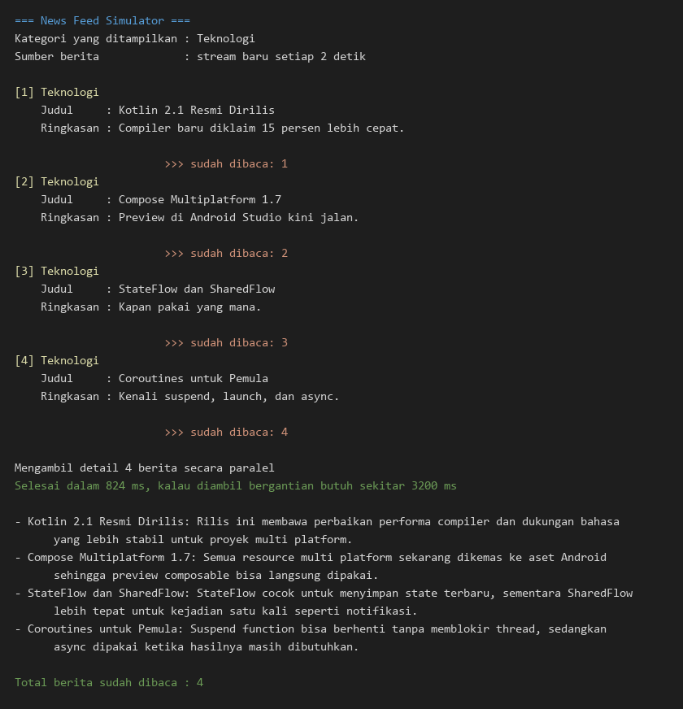

# Tugas Praktikum 2 PAM

**Nama:** Hanung Akbar Pramusintho
**NIM:** 124140207
**Kelas PAM :** RA

News Feed Simulator, proyek Kotlin untuk mensimulasikan aliran berita masuk. Proyek ini memakai Flow, StateFlow, dan Coroutines sesuai tugas praktikum 2.

## Fitur

1. Flow yang memunculkan berita baru setiap 2 detik
2. Filter berita berdasarkan kategori, pada contoh ini hanya kategori Teknologi yang dilewatkan
3. Transform data berita menjadi format tampilan yang siap dicetak ke konsol
4. StateFlow untuk menyimpan jumlah berita yang sudah dibaca, nilainya dicetak setiap kali berubah
5. Coroutines async untuk mengambil detail beberapa berita sekaligus secara paralel

## Hasil program

