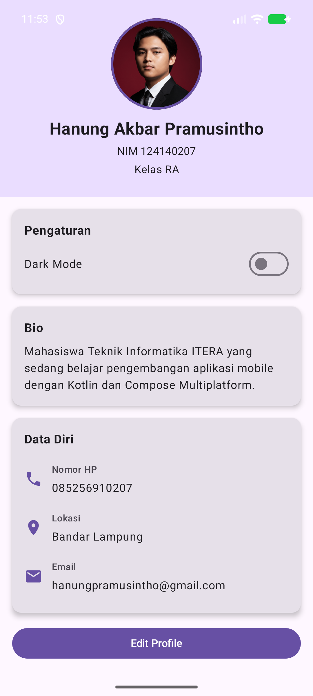
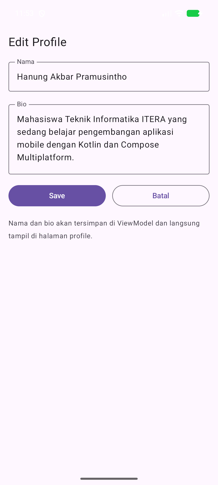
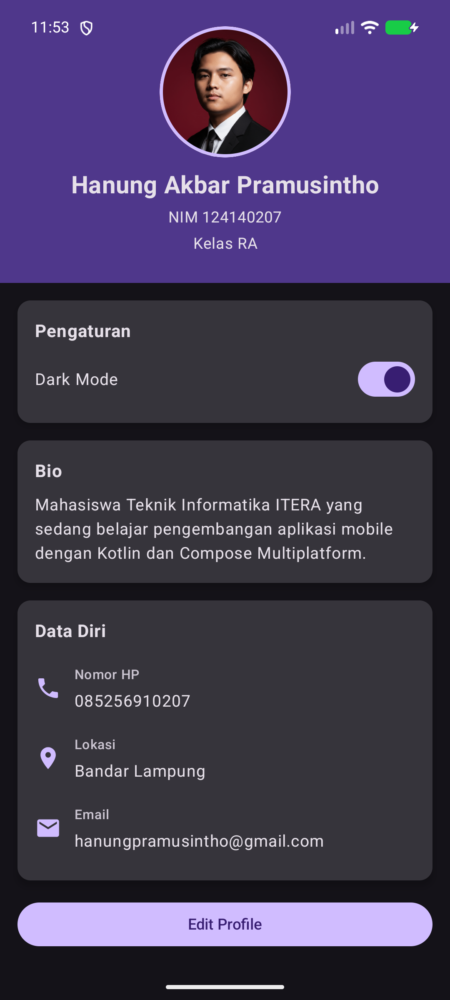

# Tugas Praktikum 4 PAM

**Nama:** Hanung Akbar Pramusintho
**NIM:** 124140207
**Kelas PAM :** RA

Aplikasi ini lanjutan dari Profile App minggu 3. Bedanya sekarang datanya diatur memakai pola MVVM, jadi UI hanya menampilkan state dan semua perubahan data lewat ViewModel.

## Fitur

1. ProfileViewModel memakai StateFlow, state UI dibungkus dalam data class ProfileUiState
2. Halaman edit profile untuk mengubah nama dan bio, fieldnya pakai state hoisting, tombol Save langsung mengirim perubahan ke ViewModel
3. Switch dark mode, statusnya juga disimpan di ViewModel

## Screenshot aplikasi

1. Halaman profile

2. Form edit profile

3. Dark mode aktif

